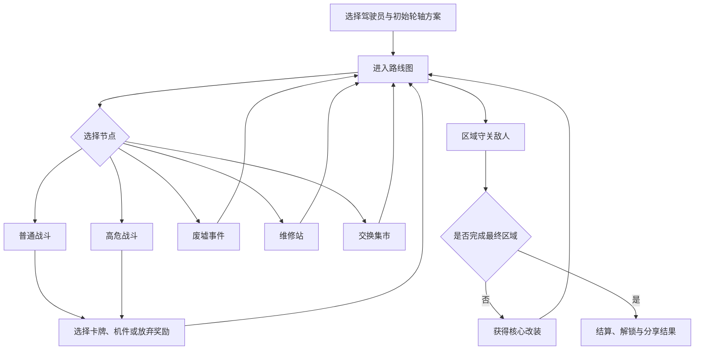

# 《沙海机城》第一版完整规划

## 一、产品定位

《沙海机城》是一款适合电脑与手机横屏游玩的浏览器牌组构筑 Roguelike。

玩家驾驶一座依靠巨型机械足行走的移动城塞，穿越被高温、沙暴与失控机械占据的大陆。每次远征都要同时管理：

- 用于战斗的“指令牌组”
- 决定整座机城运转方式的“轮轴链”

核心体验不是单纯寻找高伤害卡，而是判断：

> 这张牌现在打出去是否划算，以及它会让机城在两步之后启动什么装置。

单局目标时长：

- 垂直切片：20～30 分钟
- 完整版本：45～70 分钟
- 单场普通战斗：2～5 分钟
- 首次进入战斗：30 秒内理解基本操作

技术形态：

- 浏览器直接运行
- PC 鼠标操作
- 手机横屏触控
- 无需安装或登录
- 可通过链接公开分享
- 单局状态可以保存、恢复和复制为分享码

---

## 二、世界观与视觉方向

### 核心设定

太阳异常膨胀后，地表城市无法长期停留。幸存者将城区安装在巨型机械底盘上，依靠不断迁徙躲避灼热带和沙暴。

玩家管理的“沙海机城”必须穿过三个危险区，抵达仍在发送信号的中央气象塔。

敌人包括：

- 吞食能源线路的硅甲沙兽
- 被旧控制系统接管的工程机械
- 依靠镜面聚光攻击的无人阵列
- 将整片沙地烧结成玻璃的巨型采掘机

### 美术关键词

- 沙金、煤黑、陶瓷白、警示橙
- 巨型机械足、转轮、连杆、遮阳布、散热百叶
- 轮廓清楚、色块明确、低细节背景
- 卡面像“机械调度指令”，不是魔法卷轴
- 敌方意图用图标、轨迹和数字表达
- 避免过度写实，优先保证手机屏幕可读性

### 界面气质

整体像一张正在运转的机械控制台：

- 中央是战斗区
- 下方是手牌
- 左侧显示玩家与核心资源
- 右侧显示轮轴链
- 顶部显示敌人、意图及战斗进程
- 不依赖鼠标悬停，所有信息都可通过点击或长按查看

---

# 三、完整游戏循环



一局中的主要选择层次：

1. 路线选择：安全、收益、维修机会之间取舍。
2. 战斗选择：处理眼前威胁，还是为后续轮轴启动做准备。
3. 奖励选择：补充指令牌、安装机件，或保持构筑精简。
4. 机城整备：改变轮轴顺序，让同一套卡牌产生不同循环。
5. 长期风险：承受结构损伤换取资源，还是保守推进。

---

# 四、原创双构筑系统：指令牌组 × 轮轴链

## 4.1 第一层：指令牌组

指令牌是玩家每回合直接使用的行动。

每张牌包含：

- 能量费用
- 即时效果
- 脉冲类型
- 脉冲数值
- 可选的位移、保留或联动条件

三种基础脉冲：

- 动力：偏攻击、推进、破坏装甲
- 计算：偏抽牌、标记、精确控制
- 冷却：偏防御、恢复与降低过载

示例：

| 指令牌 | 费用 | 即时效果 | 轮轴影响 |
|---|---:|---|---|
| 推杆重击 | 1 | 造成 7 点伤害 | 注入 2 点动力 |
| 预测路径 | 1 | 抽 2 张牌，弃 1 张 | 注入 2 点计算 |
| 展开隔热板 | 1 | 获得 8 点护板 | 注入 2 点冷却 |
| 逆向传动 | 0 | 本回合下一张牌费用 +1 | 轮轴反向移动一格 |
| 强制并联 | 2 | 造成 5 点伤害并获得 5 点护板 | 向当前和下一机件各注入 1 点对应脉冲 |
| 空转等待 | 0 | 保留一张手牌 | 轮轴本次不前进 |

---

## 4.2 第二层：轮轴链

玩家拥有一个由六个位置组成的循环轮轴。

每个位置可以安装一个机件，例如：

- 冲击活塞
- 折光护墙
- 自动装填臂
- 目标演算仪
- 热量交换器
- 应急升降架

### 基本规则

1. 战斗开始时，轮轴指针位于第一个机件。
2. 每使用一张普通指令牌，指针前进一格。
3. 牌产生的脉冲注入指针抵达的机件。
4. 当机件获得满足自身条件的脉冲时，立即启动。
5. 启动后清空该机件的脉冲，并可能影响相邻机件。
6. 回合结束后，未启动的脉冲通常保留，但部分敌人可以干扰或清除它们。

### 机件示例

| 机件 | 启动条件 | 效果 |
|---|---|---|
| 冲击活塞 | 3 动力 | 对最前方敌人造成 14 点伤害 |
| 折光护墙 | 2 冷却 + 1 计算 | 获得 11 点护板，下回合保留其中一半 |
| 自动装填臂 | 3 计算 | 抽 2 张牌，其中一张本回合费用为 0 |
| 配重飞轮 | 任意 4 点脉冲 | 下一张牌不推动轮轴 |
| 串联连杆 | 左右相邻机件均已储存脉冲 | 各自额外获得 1 点已有类型的脉冲 |
| 蓄能弹簧 | 累积 5 点，不限类型 | 获得“压缩”：下次启动机件时效果翻倍，然后本机件停机一轮 |
| 清砂震荡器 | 2 动力 + 2 冷却 | 清除一个负面状态，并对所有敌人造成 6 点伤害 |

---

## 4.3 为什么它会真正改变决策

轮轴链不能只是“攒满后自动触发的被动装备”。它必须改变玩家每一次出牌顺序。

例如：

- 敌人下一回合攻击 18 点。
- 玩家手中有一张 8 点护板牌和一张 7 点攻击牌。
- 当前指针下一格是“冲击活塞”，再下一格是只差 2 点冷却就能启动的“折光护墙”。

如果先打防御牌：

- 防御牌的冷却脉冲进入冲击活塞，无法立即利用。
- 攻击牌随后推动指针到折光护墙，但注入的是动力。
- 两个机件都可能无法启动。

如果先打攻击牌：

- 动力进入冲击活塞并使其启动。
- 防御牌随后把冷却注入折光护墙并使其启动。
- 玩家同时获得额外伤害和足够防御。

于是“攻击牌先打还是防御牌先打”不再只是数学顺序，而取决于轮轴排布。

其他真实取舍包括：

- 为了让关键机件吃到正确脉冲，是否先打一张较弱的牌？
- 是否使用“空转”保留当前轮轴位置？
- 是否让某个机件提前启动，还是把脉冲留到下一回合？
- 奖励时选择更强的牌，还是选择更匹配轮轴节奏的牌？
- 是否把高价值机件相邻排列，承担被敌人同时干扰的风险？
- 要不要增加牌组厚度，以获得更稳定的脉冲类型？

---

## 4.4 双构筑的限制条件

为了防止系统退化成固定连招：

- 抽牌顺序具有变化。
- 敌人会改变进攻节奏。
- 部分敌人能锁定轮轴位置。
- 部分机件启动后需要一轮复位。
- 高级牌可能产生混合脉冲，但费用更高。
- 玩家每回合只能进行一次“手动拨轴”，且会增加过载。
- 过载达到上限时，随机一个已储能机件停机一轮。

因此玩家可以规划，但不能无成本地执行同一个循环。

---

# 五、第一版可玩垂直切片

## 5.1 目标范围

制作一个能够公开试玩、完整通关或失败、支持刷新后续玩的 20～30 分钟版本。

只做一个区域：“白昼禁行区”。

内容规模：

- 1 名驾驶员
- 1 套初始牌组
- 18 张可获得指令牌
- 10 个可获得机件
- 5 种普通敌人
- 2 种高危敌人
- 1 个最终守关敌人
- 6 个事件
- 1 个维修站界面
- 1 个交换集市界面
- 1 张由三列节点组成的路线图
- 1 个胜利结算
- 1 个失败结算
- 本地保存、种子复现、结果分享码

## 5.2 初始配置

初始牌组共 10 张：

- 推杆重击 ×4
- 展开隔热板 ×4
- 预测路径 ×1
- 空转等待 ×1

初始轮轴：

1. 冲击活塞
2. 空插槽
3. 折光护墙
4. 空插槽
5. 自动装填臂
6. 空插槽

初始数值：

- 城体完整度：70
- 每回合能量：3
- 每回合抽牌：5
- 手动拨轴次数：每回合 1 次
- 过载上限：6

## 5.3 路线结构

固定生成 8～10 个可选节点：

- 3～4 场普通战斗
- 1 场高危战斗
- 1～2 个事件
- 1 个维修站或集市
- 1 场最终战

路线应提供至少两条明显策略：

- 更多战斗，获得更多构筑奖励
- 更安全的整备路线，但成长机会较少

## 5.4 最终敌人：镜日采掘机

三阶段战斗：

### 第一阶段：聚光校准

- 提前显示下一回合攻击目标。
- 迫使玩家建立基础防御。
- 每三回合给一个轮轴位置施加“曝光”。

### 第二阶段：玻璃化地面

- 曝光位置启动时，玩家增加 2 点过载。
- 玩家需要调整出牌顺序或拨轴绕开危险位置。

### 第三阶段：全功率切割

- 敌人获得持续增强的攻击。
- 玩家必须利用已完成的构筑快速结束战斗。
- 不设计无限拖延的安全解法。

守关敌人必须同时检验：

- 即时攻防
- 脉冲规划
- 轮轴顺序管理
- 过载控制
- 构筑是否具备结束战斗的能力

---

# 六、状态架构

推荐使用 TypeScript，将玩法状态与界面状态彻底分开。

## 6.1 顶层结构

```ts
type GameState = {
  schemaVersion: number;
  app: AppState;
  run: RunState | null;
  combat: CombatState | null;
  profile: ProfileState;
  settings: SettingsState;
};
```

## 6.2 局内状态

```ts
type RunState = {
  runId: string;
  seed: string;
  rngCursor: number;

  phase:
    | "route"
    | "combat"
    | "reward"
    | "event"
    | "repair"
    | "market"
    | "victory"
    | "defeat";

  regionIndex: number;
  currentNodeId: string | null;
  visitedNodeIds: string[];

  hull: number;
  maxHull: number;
  currency: number;

  deck: CardInstance[];
  wheel: WheelState;
  inventory: ConsumableInstance[];

  route: RouteGraph;
  pendingReward: RewardState | null;
  history: RunHistoryEntry[];
};
```

## 6.3 轮轴状态

```ts
type WheelState = {
  slots: WheelSlot[];
  pointer: number;
  manualShiftUsed: boolean;
  overload: number;
  overloadLimit: number;
};

type WheelSlot = {
  slotIndex: number;
  module: ModuleInstance | null;
  storedPulse: {
    power: number;
    logic: number;
    cooling: number;
  };
  disabledTurns: number;
  exposedTurns: number;
};
```

## 6.4 战斗状态

```ts
type CombatState = {
  encounterId: string;
  turn: number;
  activeSide: "player" | "enemy" | "resolving";
  energy: number;
  maxEnergy: number;

  drawPile: CardInstance[];
  hand: CardInstance[];
  discardPile: CardInstance[];
  exhaustPile: CardInstance[];

  playerStatuses: StatusInstance[];
  enemies: EnemyState[];

  intentSnapshot: EnemyIntent[];
  effectQueue: GameEffect[];
  inputLock: boolean;

  combatLog: CombatLogEntry[];
  result: "ongoing" | "won" | "lost";
};
```

## 6.5 数据、规则、表现分层

```text
内容定义层
├─ 卡牌定义
├─ 机件定义
├─ 敌人定义
├─ 事件定义
└─ 路线与奖励表

规则层
├─ reducer
├─ 合法行动判断
├─ 效果队列
├─ 伤害与护板结算
├─ 轮轴移动和机件启动
└─ 种子随机数

表现层
├─ 战斗界面
├─ 动画
├─ 音效
├─ 提示框
└─ 横屏响应式布局
```

关键原则：

- 所有玩法变化都通过显式 `GameAction` 进入 reducer。
- 动画不能直接修改玩法数据。
- 随机结果只能来自种子随机数生成器。
- 卡牌与机件尽量采用数据定义，不把效果散落在 UI 组件中。
- 存档只保存纯数据，不保存 DOM、定时器或动画对象。
- 每次行动完成后都能序列化。
- 相同种子、相同行动序列必须得到相同结果。

## 6.6 行动与效果队列

典型行动：

```ts
type GameAction =
  | { type: "PLAY_CARD"; cardInstanceId: string; targetId?: string }
  | { type: "MANUAL_SHIFT"; direction: -1 | 1 }
  | { type: "END_TURN" }
  | { type: "SELECT_ROUTE_NODE"; nodeId: string }
  | { type: "SELECT_REWARD"; rewardId: string }
  | { type: "SKIP_REWARD" }
  | { type: "INSTALL_MODULE"; moduleId: string; slotIndex: number }
  | { type: "SWAP_MODULES"; from: number; to: number };
```

一张牌的结算顺序固定为：

1. 检查费用和目标是否合法。
2. 扣除能量。
3. 移除手牌。
4. 执行即时效果。
5. 计算并移动轮轴。
6. 注入脉冲。
7. 检查当前机件是否启动。
8. 把衍生效果加入队列。
9. 依次结算队列及连锁启动。
10. 将牌放入弃牌堆或移除区。
11. 检查敌人死亡、玩家失败和战斗结束。

必须设置单次行动的最大连锁次数，例如 50 次，避免错误组合造成死循环。

---

# 七、PC 与手机横屏设计

## PC 布局

- 推荐画布比例：16:9
- 最低支持：1280×720
- 手牌支持鼠标指向放大
- 点击选牌，再点击目标
- 右键或 Esc 取消
- 数字键 1～9 可选手牌
- 空格结束回合，但需要二次确认或短暂防误触

## 手机横屏布局

- 最低目标视口：720×360 CSS 像素
- 手牌允许横向滑动
- 点按卡牌先展开，再点目标确认
- 长按查看完整说明
- 所有主要点击区域不小于 44×44 CSS 像素
- 结束回合按钮远离手牌区
- 不使用仅靠悬停才能看到的信息
- 浏览器地址栏变化不能导致战斗区跳动
- 安全区域适配圆角屏和摄像头缺口

## 战斗信息优先级

手机端持续显示：

- 玩家完整度
- 当前能量
- 敌人下一步意图
- 手牌费用
- 当前轮轴位置
- 各机件储存脉冲
- 过载值

次要说明通过点击面板打开，不长期占据画面。

---

# 八、开发顺序

## 阶段 1：无美术规则原型

先完成：

- 固定一场战斗
- 抽牌、出牌、弃牌
- 攻击、护板、能量
- 敌人意图
- 轮轴移动
- 三种脉冲
- 三个初始机件
- 胜负结算
- 固定种子

成功标准：纯色块界面下，核心双构筑已经产生出牌顺序差异。

## 阶段 2：验证双构筑

加入：

- 8～10 张测试牌
- 6 个测试机件
- 手动拨轴
- 过载
- 机件停机
- 连锁启动日志

重点测试：

- 是否存在明显唯一最优顺序
- 玩家是否能预测下一次机件启动
- 机件是否只是被动加数值
- 卡牌与机件是否能分别形成构筑方向

双构筑没有通过验证前，不开发路线图和大量内容。

## 阶段 3：完成单局闭环

加入：

- 路线图
- 战斗奖励
- 事件
- 维修站
- 集市
- 最终敌人
- 胜利和失败结算

成功标准：能从新游戏一直玩到通关或失败。

## 阶段 4：数据化内容

把卡牌、机件、敌人和事件迁移到统一定义表：

- 内容 ID 稳定
- 逻辑与文本分离
- 数值可以集中修改
- 奖励池可以按标签筛选
- 存档不依赖显示名称

## 阶段 5：响应式界面

优先处理：

- 360p 横屏可读性
- 触控目标
- 手牌展开
- 轮轴链展示
- 敌人意图
- 信息弹层
- 横竖屏提示
- 页面缩放和安全区域

## 阶段 6：表现与反馈

最后添加：

- 轮轴转动动画
- 脉冲沿线路进入机件的动画
- 机件启动反馈
- 伤害、护板、过载音效
- 轻量屏幕震动
- 沙尘和热浪背景

动画必须可加速或关闭，并且不能改变结算时序。

## 阶段 7：保存与公开分享

加入：

- 自动存档
- 继续游戏
- 种子输入
- 战绩分享码
- 静态托管
- HTTPS
- 错误日志
- 基础访问统计
- 版本号和更新说明

---

# 九、实现提示词

## 9.1 主开发提示词

```text
你是一名资深 TypeScript 浏览器游戏工程师。请实现一款原创横屏牌组构筑 Roguelike《沙海机城》的第一版垂直切片。

核心不是复刻任何现有游戏的文本、角色或视觉，而是实现“指令牌组 × 轮轴链”的双构筑系统。

技术要求：
1. 使用 TypeScript 和适合静态部署的前端框架。
2. 玩法状态必须是可序列化纯数据。
3. 所有状态变化通过 GameAction 和纯 reducer 完成。
4. 随机数由字符串种子驱动，相同种子和相同行动必须得到相同结果。
5. UI 动画不能直接修改玩法状态。
6. 支持 PC 鼠标和手机横屏触控。
7. 不允许把关键信息只放在 hover 中。
8. 支持刷新后恢复当前局。
9. 支持导出和导入分享码。
10. 内容定义与执行逻辑分离。

先只实现一场固定战斗：
- 玩家 70 点完整度、3 点能量、每回合抽 5 张牌。
- 10 张初始牌。
- 由 6 个位置组成的轮轴链。
- 每出一张普通牌，轮轴前进一格。
- 卡牌产生动力、计算或冷却脉冲。
- 脉冲注入抵达的机件。
- 机件满足条件后启动。
- 玩家每回合可以手动拨轴一次，但增加过载。
- 敌人必须提前显示下一步意图。

实现时按以下顺序工作：
A. 类型定义和内容定义。
B. 种子随机数。
C. reducer 与效果队列。
D. 自动化单元测试。
E. 最小战斗 UI。
F. 触控适配。
G. 保存与恢复。

不要先制作复杂美术、路线图或元成长。每完成一个阶段，都输出可运行结果、已通过测试、尚未完成事项和下一阶段风险。
```

## 9.2 内容扩展提示词

```text
为《沙海机城》设计第一版内容池。

已确定核心系统：
- 指令牌具有能量费用、即时效果和脉冲输出。
- 脉冲分为动力、计算、冷却。
- 每出一张牌会推动六格轮轴。
- 机件根据当前格接收到的脉冲启动。
- 出牌顺序必须影响机件能否在正确时间启动。

请输出：
1. 18 张可获得指令牌。
2. 10 个可获得机件。
3. 5 种普通敌人。
4. 2 种高危敌人。
5. 1 个三阶段守关敌人。
6. 6 个具有明确风险与收益的事件。

约束：
- 每张牌至少影响即时局势或轮轴规划中的一项，最好同时影响两项。
- 不要只设计“伤害数字更高”的升级版卡牌。
- 至少设计三种不同构筑方向。
- 每种构筑都必须有弱点。
- 不允许出现无需观察敌人即可重复执行的稳定无限循环。
- 所有敌人都要提前展示意图。
- 所有文本使用具体、简短、低认知成本的中文。
- 为每项内容注明设计目的、协同对象、反制方式和预期数值区间。
```

## 9.3 UI 视觉提示词

```text
设计一张原创浏览器游戏《沙海机城》的横屏战斗界面效果图。

场景是一座穿越高温沙漠的巨型移动机械城，不使用海洋、船只、腐蚀金属或哥特尖塔意象。

画面比例 16:9，适合同时缩放到电脑屏幕与手机横屏。

布局：
- 中央为敌人与战斗场景。
- 下方为五张扇形展开的指令牌。
- 左侧显示玩家城体完整度、能量和状态。
- 右侧显示一个由六个机械位置组成的循环轮轴。
- 每个轮轴位置显示机件图标、三类脉冲储量和停机状态。
- 顶部敌人头顶显示下一步行动意图与准确数值。
- 右下角有醒目的结束回合按钮。

视觉语言：
- 沙金、煤黑、陶瓷白、警示橙。
- 大色块、清楚轮廓、有限纹理。
- 机械连杆、散热百叶、遮阳布和陶瓷装甲。
- UI 像机械调度台，但保持现代、清爽、易读。
- 文字区域留出真实可用空间，不生成乱码。
- 所有关键按钮在手机上仍有足够触控面积。
```

## 9.4 测试审查提示词

```text
你是一名严格的游戏 QA 与系统设计审查员。请检查《沙海机城》垂直切片。

重点寻找：
1. 相同种子无法复现的问题。
2. 刷新页面后状态丢失或重复结算。
3. 动画期间连续点击导致重复出牌。
4. 轮轴指针、脉冲归属或启动顺序错误。
5. 多个机件连锁启动造成死循环。
6. 敌人意图与实际行动不一致。
7. 手机横屏上文字过小、按钮重叠或无法滚动。
8. 必须依赖 hover 才能获取的信息。
9. 存在不观察敌人即可重复执行的唯一最优策略。
10. 机件退化为无须规划的被动加成。
11. 奖励池出现无法退出、无法跳过或空奖励。
12. 胜负同时触发、死亡后仍可操作等边界错误。

请按“复现步骤、预期结果、实际结果、严重等级、可能原因”输出问题。不能仅给主观评价，每个问题都必须提供可复现路径。
```

---

# 十、可验证验收标准

## 10.1 核心战斗

- 新游戏进入第一场战斗不超过 3 次交互。
- 每回合正确抽取 5 张牌，牌堆不足时按规则重组弃牌堆。
- 能量不足的牌无法打出，并显示明确原因。
- 非法目标无法确认。
- 敌人行动前始终显示意图、目标和数值。
- 意图数值与实际结算一致。
- 护板、伤害、状态效果具有固定且有测试覆盖的结算顺序。
- 战斗结束后不能继续出牌。
- 玩家和最后一个敌人同时归零时，结果遵循明确定义且测试通过。

## 10.2 双构筑系统

- 每使用一张普通牌，轮轴恰好移动一格。
- 特殊“不移动”“反向移动”效果按牌面准确执行。
- 脉冲只能进入规则指定的轮轴位置。
- 机件满足条件时只启动一次。
- 启动后脉冲是否清空与文本完全一致。
- 单次行动超过 50 次衍生结算时自动中止并记录错误。
- 至少存在三个测试局面，改变两张牌的出牌顺序会导致不同机件启动。
- 至少存在一个局面，伤害最高的即时出牌不是回合最佳决策。
- 至少存在一个局面，玩家应主动放弃机件立即启动，以保留下一回合的组合。
- 试玩测试中，80% 的玩家在第二场战斗结束前能正确预测下一张牌会把脉冲送入哪个位置。
- 玩家不能仅看手牌而完全忽略轮轴完成最终战。
- 玩家也不能只依赖轮轴自动输出而完全忽略敌人意图。

## 10.3 单局闭环

- 可以从开始界面完整玩到胜利或失败。
- 路线中不存在无法进入或无法退出的节点。
- 战斗奖励可以选择，也可以放弃。
- 卡牌、机件、事件、维修和集市至少各出现一次。
- 最终敌人三阶段均能稳定触发。
- 胜利结算显示种子、用时、剩余完整度和核心构筑。
- 失败后可以使用同一种子重新开始。
- 连续完成 20 局自动路线模拟，不出现状态机卡死。

## 10.4 存档与确定性

- 任意合法行动完成后刷新页面，可以恢复到该行动之后。
- 战斗动画中刷新，不会重复扣费、重复伤害或复制奖励。
- 相同版本、相同种子、相同行动序列得到完全一致的：
  - 路线图
  - 抽牌顺序
  - 敌人行为
  - 奖励选项
  - 战斗结果
- 旧版本存档无法迁移时，必须显示明确提示，不能静默损坏。
- 分享码解码失败时不会覆盖现有存档。
- 存档数据不包含函数、DOM 引用或不可序列化对象。

## 10.5 PC 与手机横屏

在以下视口实测：

- 1920×1080
- 1366×768
- 1280×720
- 844×390
- 740×360

验收要求：

- 无关键面板互相遮挡。
- 不需要页面级横向滚动。
- 手牌可以完整浏览。
- 所有主要触控区域至少 44×44 CSS 像素。
- 关键正文在 740×360 下仍可辨认。
- 不依赖 hover 完成任何操作。
- 长按说明不会触发出牌。
- 快速双击不会重复结算。
- 横屏尺寸变化后，选中的卡牌与弹层仍在可视范围内。
- 误切竖屏时显示友好的横屏提示，并保留当前局状态。

## 10.6 性能与公开分享

- 首次核心资源加载在常见 4G 环境下控制在合理范围，垂直切片建议不超过 8 MB。
- 中端手机战斗过程目标保持 30 FPS 以上。
- PC 目标保持 60 FPS。
- 页面隐藏后停止非必要动画。
- 音频默认遵循浏览器自动播放限制。
- 静态部署后通过 HTTPS 访问。
- 复制公开链接后可在无登录、无本地开发环境的设备打开。
- 控制台无持续报错。
- 资源加载失败时显示可理解的重试界面。
- 部署版本明确显示版本号。

---

# 十一、三种首版构筑方向

## 重型冲击

- 主要脉冲：动力
- 核心：冲击活塞、蓄能弹簧
- 优点：高爆发，快速处理高威胁目标
- 弱点：防御不足，过早启动会浪费蓄能
- 决策重点：控制高动力牌进入正确位置

## 演算循环

- 主要脉冲：计算
- 核心：自动装填臂、配重飞轮
- 优点：控制手牌与轮轴节奏
- 弱点：直接数值较低，容易因过载中断
- 决策重点：什么时候不推动轮轴，比多打一张牌更重要

## 温差壁垒

- 主要脉冲：冷却与混合脉冲
- 核心：折光护墙、清砂震荡器
- 优点：稳定防御，擅长处理负面状态
- 弱点：结束战斗较慢，面对持续增强敌人有压力
- 决策重点：防御脉冲用于当前保命，还是留给混合机件

首版平衡目标不是让三套构筑完全对称，而是确保每套都：

- 能通关
- 有明显短板
- 需要观察敌人
- 会因为轮轴排列不同而改变出牌顺序
- 不存在固定重复的无脑操作序列

---

# 十二、第一版明确不做的内容

为了确保垂直切片能完成，暂不加入：

- 多角色
- 多区域长流程
- 永久数值成长
- 在线排行榜
- 多人模式
- 云端账号
- 大量剧情动画
- 自由拖拽式城建
- 装备合成
- 程序化三维场景
- 用户生成内容
- 复杂本地化系统

第一版最重要的验证问题只有一个：

> 玩家是否愿意为了让轮轴链在正确时机启动，重新思考每一张牌的出牌顺序？

如果这个问题的答案是肯定的，《沙海机城》才值得继续扩展内容、角色和完整流程。
